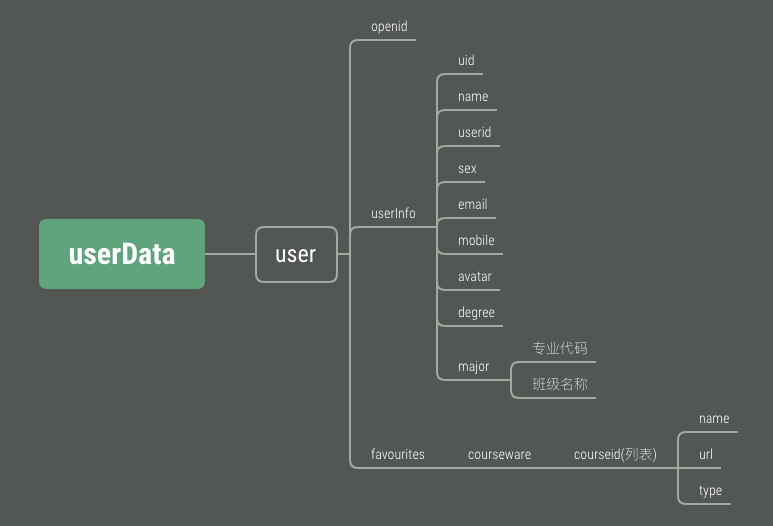

# “我的大学”小程序数据库设计文档
本项目使用非关系型数据库MongoDB作为数据库，主要存储小程序相关业务数据，原企业号及多模式教学网相关数据通过接口的形式获取。
## 一、结构


## 二、接口
### 1、用户信息获取
**函数名称**：getUserInfo  
**传入参数**：openid  
**返回类型**：dict  
**返回示例**：
```
{
    "userInfo": {
        "sex": 1,
        "userid": "171******",
        "avatar": "http://p.qlogo.cn/bizmail/z2LWEF4DG0ianP4UCV45ZfFLVpSTOB2B7Oi*******************",
        "email": "10*******@qq.com",
        "major": {
            "738": "\u7535\u*********"
        },
        "degree": "\u672******",
        "uid": 9***,
        "mobile": "13604*******",
        "name": "\u97a0\u6b*******"
    },
    "openid": "o1Glo5BZgdDoVq********"
}
```
**备注**：通过openid获取用户信息，若该用户不存在，则返回None。
### 2、新建用户
**函数名称**：newUser    
**传入参数**：openid、userInfo  
**返回类型**：空
### 3、获取公开信息
**函数名称**：getPublicInfo    
**传入参数**：空  
**返回类型**：dict  
**返回实例**：